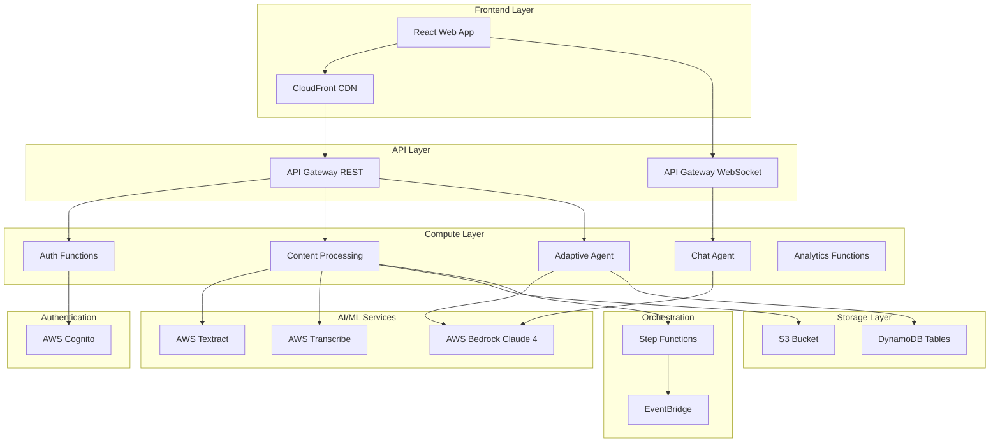
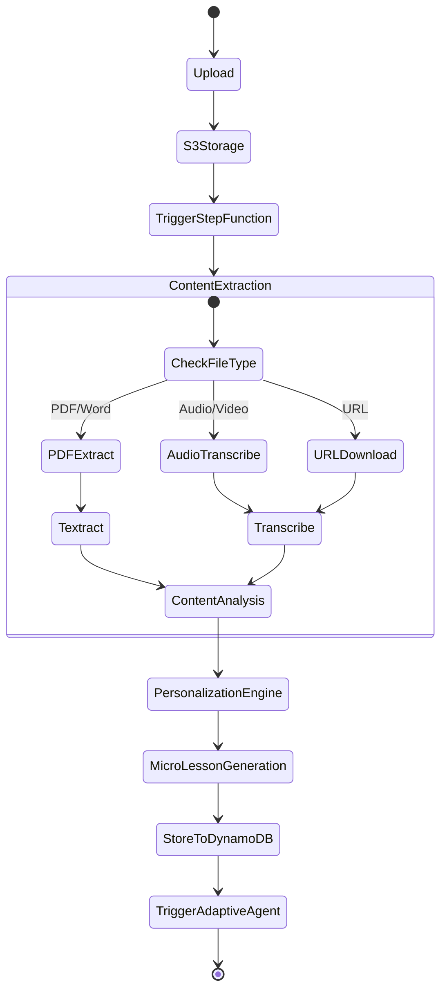
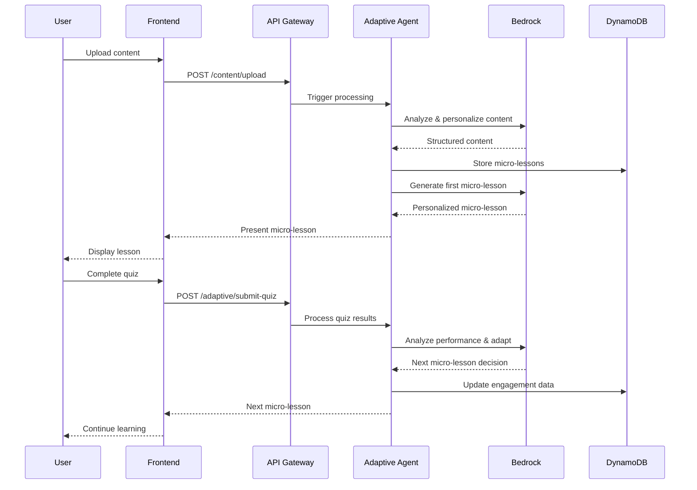

# SnapStudy Design Document

## Overview

SnapStudy is designed as a serverless, event-driven autonomous learning platform built on AWS that converts educational content (PDF, audio, video, YouTube) into personalized micro-lessons with adaptive quizzes and intelligent tutoring. The system uses AWS Bedrock Claude 4 for autonomous decision-making and adapts learning paths based on real-time user performance, creating a truly personalized learning experience that operates without manual intervention.

## Architecture

### High-Level Architecture



### Component Architecture

The system is organized into 5 core components that align with the requirements:

1. **User Management & Data Repository**
2. **Content Processing Engine** 
3. **Adaptive Learning Agent**
4. **Chat & Feedback Agent**
5. **Frontend Web Application**

## Components and Interfaces

### Component 1: User Management & Data Repository

**Purpose:** Handle authentication, user profiles, and persistent storage for all learning data.

**Services:** Cognito, Lambda, API Gateway (REST), DynamoDB, IAM

**DynamoDB Tables:**

1. **Users** - Store user profiles
   - Primary Key: user_id
   - Attributes: email, name, age, profession, country, learning_preferences (style, pace, attention_span_minutes), interests, timezone, timestamps
   - TTL: none

2. **Lessons** - Store uploaded content and processed lessons
   - Primary Key: lesson_id
   - Attributes: user_id, title, source_type, source_url, processed_content, total_micro_lessons, difficulty_level, estimated_duration, tags, status
   - TTL: 90 days for abandoned lessons

3. **MicroLessons** - Store individual lesson segments
   - Primary Key: micro_lesson_id
   - Attributes: lesson_id, sequence_number, content (markdown), duration_minutes, key_concepts, difficulty_level

4. **Quizzes** - Store quiz questions and metadata
   - Primary Key: quiz_id
   - Attributes: micro_lesson_id, questions array (question_text, type, options, correct_answer, explanation, difficulty)

5. **UserEngagement** - Track all learning interactions
   - Primary Key: engagement_id
   - Attributes: user_id, lesson_id, micro_lesson_id, quiz_score, time_spent_seconds, completion_status, quiz_attempts, struggled_concepts, timestamp
   - TTL: 365 days

6. **ChatHistory** - Store conversation data
   - Primary Key: session_id
   - Attributes: user_id, lesson_id, messages array, timestamps
   - TTL: 30 days

**Lambda Functions (Following Single Responsibility):**
- `auth-signup`: Handle user registration
- `auth-login`: Handle authentication
- `user-profile-read`: Get user profile
- `user-profile-update`: Update user profile
- `lessons-crud`: Handle lesson operations
- `engagement-tracker`: Record user interactions
- `analytics-aggregator`: Generate analytics

**API Endpoints:**
- Authentication: POST /auth/signup, /auth/login, /auth/logout
- User Profile: GET/PUT /users/{user_id}
- Lessons: GET/POST/PUT/DELETE /lessons, /lessons/{lesson_id}
- Micro-lessons: GET /micro-lessons?lesson_id={id}
- Quizzes: GET /quizzes, POST /quizzes/{quiz_id}/submit
- Engagement: POST /engagement, GET /engagement/analytics, /engagement/progress

### Component 2: Content Processing Engine

**Purpose:** Transform raw uploaded content into clean, personalized, structured lesson text.

**Services:** S3, Textract, Transcribe, Bedrock Claude 4, Step Functions, Lambda, EventBridge, SQS

**Video Chunk Handling:**
When full video cannot be saved, original chunks are stored in S3. Metadata links each chunk to micro-lessons in DynamoDB. Overlapping topic chunks automatically merged by Claude during lesson generation.

**Workflow Steps:**
1. User uploads file → Store in S3 → Trigger Step Function
2. Extract content: PDF → Textract, Audio/Video → Transcribe, YouTube → Download + Transcribe
3. Analyze structure using Bedrock Claude: Extract topics, concepts, learning objectives, difficulty level
4. Personalize content using Bedrock Claude: Rewrite based on user's age, profession, learning style, attention span, interests
5. Save processed lesson to DynamoDB
6. Trigger Adaptive Learning Agent (Component 3)

**Bedrock Prompt Guidelines:**

*Content Structuring:*
- Input: Raw transcript/text + user profile
- Task: Identify main topics, extract key concepts, determine prerequisites, estimate difficulty, structure into logical sections
- Output: JSON with structured lesson sections

*Content Personalization:*
- Input: Structured content + detailed user profile
- Task: Rewrite for appropriate complexity, use relevant examples from user's profession/country, match learning style, add appropriate analogies
- Output: Markdown-formatted personalized lesson text

**API Endpoints:**
- POST /content/upload - Upload file or URL
- GET /content/status/{lesson_id} - Check processing status

**Workflow Architecture:**


**Step Function Definition:**
```json
{
  "Comment": "Content Processing Workflow",
  "StartAt": "ExtractContent",
  "States": {
    "ExtractContent": {
      "Type": "Choice",
      "Choices": [
        {
          "Variable": "$.fileType",
          "StringEquals": "pdf",
          "Next": "TextractExtraction"
        },
        {
          "Variable": "$.fileType", 
          "StringMatches": "audio/*",
          "Next": "TranscribeAudio"
        }
      ]
    },
    "TextractExtraction": {
      "Type": "Task",
      "Resource": "arn:aws:lambda:region:account:function:textract-processor",
      "Next": "AnalyzeStructure"
    },
    "AnalyzeStructure": {
      "Type": "Task",
      "Resource": "arn:aws:lambda:region:account:function:content-analyzer",
      "Next": "PersonalizeContent"
    },
    "PersonalizeContent": {
      "Type": "Task", 
      "Resource": "arn:aws:lambda:region:account:function:content-personalizer",
      "End": true
    }
  }
}
```

### Component 3: Adaptive Learning Agent (Core Autonomous Agent)

**Purpose:** The autonomous brain that makes real-time decisions on lesson sequencing, quiz generation, and adaptive learning paths without manual intervention.

**Services:** Bedrock Claude 4, AgentCore primitives, DynamoDB, Step Functions, Lambda, SQS, EventBridge optional Bedrock Nova for audio/video

**Autonomous Decision Loop:**
1. Fetch user context (profile, progress, engagement history, recent performance)
2. Reasoning Phase (AgentCore): Analyze performance, identify knowledge gaps, plan next optimal lesson
3. Generate micro-lesson (Bedrock): Segment content, adjust difficulty, personalize examples
4. Generate adaptive quiz (Bedrock): Create questions with appropriate difficulty distribution (MCQ, True/False, Short Answer)
5. Check quiz answers using intelligent evaluation, Generate detailed feedback
6. Present to learner via frontend
7. Collect feedback (quiz results, time spent, engagement metrics)
8. Update state in DynamoDB
9. Loop back to step 1 until lesson complete

**Adaptation Logic:**
- Quiz score < 60%: Generate review micro-lesson with easier quiz
- Quiz score 60-80%: Repeat concept with different examples
- Quiz score > 80% but slow completion: Reduce content density
- Quiz score > 80% and fast: Increase difficulty level
- Low engagement time: Shorten next micro-lesson
- High engagement time: Simplify complex content

**AgentCore Primitives Usage:**
- **Reasoning over context**: Analyze learner state and decide next action
- **Planning**: Multi-step lesson sequencing
- **Memory**: Maintain user state across sessions
- **Function invocation**: Call lesson/quiz generators
- **State updates**: Write to DynamoDB

**Bedrock Prompt Guidelines:**

*Adaptive Agent Decision Making:*
- Input: User profile + lesson content + recent quiz scores + engagement metrics + current position
- Task: Decide whether to advance/review/reinforce/simplify, generate next micro-lesson content, create adaptive quiz
- Output: JSON with decision, next micro-lesson content, quiz questions, reasoning explanation

*Quiz Generation:*
- Input: Micro-lesson content + learner performance context + struggling concepts
- Task: Create 5 questions (mix of MCQ, True/False, Short Answer) with difficulty distribution based on performance
- Output: JSON with questions, options, correct answers, explanations

**API Endpoints:**
- POST /adaptive/start-lesson - Initialize learning session
- GET /adaptive/next-micro-lesson - Get next micro-lesson (autonomous decision)
- POST /adaptive/submit-quiz - Submit quiz for evaluation
- POST /adaptive/check-answer - Check individual answer (NEW)
- GET /adaptive/quiz-feedback/{quiz_id} - Get detailed feedback (NEW)
- POST /adaptive/request-hint - Get contextual hint for current question (NEW)

**AgentCore Integration:**
```python
class AdaptiveLearningAgent:
    def __init__(self):
        self.bedrock_client = boto3.client('bedrock-runtime')
        self.agent_core = AgentCore()
        
    def autonomous_decision_loop(self, user_id: str, lesson_id: str):
        """Main autonomous decision loop"""
        while not self.is_lesson_complete(lesson_id):
            # 1. Fetch user context
            context = self.fetch_user_context(user_id)
            
            # 2. Reasoning phase using AgentCore
            decision = self.agent_core.reason_over_context(
                context=context,
                goal="optimize_learning_path"
            )
            
            # 3. Generate micro-lesson
            micro_lesson = self.generate_micro_lesson(decision, context)
            
            # 4. Present to user and collect feedback
            feedback = self.present_and_collect_feedback(micro_lesson)
            
            # 5. Update state
            self.agent_core.update_memory(feedback)
            self.update_dynamodb_state(user_id, feedback)
```

**Adaptation Logic Implementation:**
```python
def analyze_performance_and_adapt(self, quiz_score: float, completion_time: int, 
                                engagement_metrics: dict) -> dict:
    """Autonomous adaptation based on performance metrics"""
    
    adaptation_prompt = f"""
    Analyze learner performance and decide next action:
    
    Performance Data:
    - Quiz Score: {quiz_score}%
    - Completion Time: {completion_time} seconds
    - Engagement: {engagement_metrics}
    - User Profile: {self.get_user_profile()}
    
    Decide: advance/review/reinforce/simplify
    Generate: next micro-lesson content with appropriate recap
    """
    
    response = self.bedrock_client.invoke_model(
        modelId='anthropic.claude-4-0',
        body=json.dumps({
            'prompt': adaptation_prompt,
            'max_tokens': 2000
        })
    )
    
    return json.loads(response['body'].read())
```

### Component 4: Chat & Feedback Agent

**Purpose:** Real-time conversational AI tutor for Q&A, explanations, and feedback during learning.

**Services:** Bedrock Claude 4, Lambda, API Gateway (WebSocket), DynamoDB

**Features:**
- Context-aware Q&A about current micro-lesson
- On-demand summarization
- Alternative explanations for confused learners
- Positive reinforcement and encouragement
- Feedback collection

**Special Commands:**
- `/summarize` - Summarize current micro-lesson
- `/explain [concept]` - Deep dive explanation
- `/repeat` - Explain differently
- `/quiz` - Additional practice questions
- `/progress` - Show learning progress
- `/help` - List available commands

**Bedrock Prompt Guidelines:**
- Input: Learner name + current micro-lesson content + conversation history + user message
- Task: Answer helpfully, reference lesson content, adjust complexity to learner level, keep responses concise (2-3 paragraphs)
- Maintain friendly tone, admit when unsure

**API Endpoints:**
- WebSocket /chat - Real-time chat connection
- POST /chat/message - Send message (REST fallback)
- GET /chat/history?session_id={id} - Retrieve history

**WebSocket Architecture:**
```python
class ChatAgent:
    def __init__(self):
        self.bedrock_client = boto3.client('bedrock-runtime')
        
    async def handle_message(self, connection_id: str, message: str, context: dict):
        """Handle real-time chat messages"""
        
        # Check for special commands
        if message.startswith('/'):
            return await self.handle_command(message, context)
            
        # Generate context-aware response
        response = await self.generate_response(message, context)
        
        # Send via WebSocket
        await self.send_websocket_message(connection_id, response)
        
        # Update conversation history
        self.update_chat_history(connection_id, message, response)
```

**Special Commands Implementation:**
```python
def handle_command(self, command: str, context: dict) -> str:
    """Handle special chat commands"""
    
    commands = {
        '/summarize': self.summarize_current_lesson,
        '/explain': self.explain_concept,
        '/repeat': self.alternative_explanation,
        '/quiz': self.generate_practice_questions,
        '/progress': self.show_progress,
        '/help': self.show_help
    }
    
    cmd_name = command.split()[0]
    if cmd_name in commands:
        return commands[cmd_name](command, context)
```

### Component 5: Frontend Web Application

**Purpose:** Modern, responsive React web app providing intuitive UI for all SnapStudy features.

**Tech Stack:** React 18 + TypeScript, Vite, Tailwind CSS, shadcn/ui, Zustand, React Router v6, AWS Amplify SDK, Framer Motion, Lucide React

**Design System:**

*Color Palette:*
- Primary: Blue (#0ea5e9 and shades)
- Accent: Purple (#8b5cf6)
- Success: Green (#10b981)
- Warning: Orange (#f59e0b)
- Error: Red (#ef4444)
- Neutrals: Grays (#f9fafb to #111827)
- Support dark mode

*Typography:*
- Font: Inter, system fonts fallback
- Sizes: 12px to 36px scale
- Weights: 400 (normal), 500 (medium), 600 (semibold), 700 (bold)

*Spacing: 4px base unit (4, 8, 12, 16, 24, 32, 48, 64px)*

*Border Radius: 6px (small), 8px (medium), 12px (large), 16px (xl)*

**Page Designs & User Flows:**

1. **Authentication Pages**
   - Sign Up Page (/signup): Centered card layout with logo, full name/email/password fields, social auth buttons
   - Login Page (/login): Email/password fields, "Remember me" checkbox, social login options
   - Onboarding Flow (/onboarding): 4-step wizard collecting personal info, learning preferences, interests, goals

2. **Dashboard (/dashboard)**
   - Top navigation with logo, search, notifications, profile avatar
   - Welcome message, progress overview card, metric cards (lessons, time, score)
   - "Continue Learning" section, "Recent Lessons" grid, floating upload button

3. **Upload Page (/upload)**
   - Drag-and-drop zone supporting PDF, MP3, MP4, YouTube URLs
   - File validation, upload progress, metadata fields

4. **Processing Status Page (/lesson/{id}/processing)**
   - Animated spinner, step-by-step status, estimated time, educational tips

5. **Lesson Viewer Page (/lesson/{id})**
   - Breadcrumb navigation, progress indicator, markdown content
   - Embedded media players, collapsible chat widget, navigation buttons

6. **Quiz Page (/lesson/{id}/quiz/{micro_id})**
   - Question counter, large question card, answer options
   - Immediate feedback, detailed explanations, "Ask AI Tutor" button

7. **Quiz Results Page (/lesson/{id}/quiz/{quiz_id}/results)**
   - Score display, performance metrics, concept breakdown
   - AI-generated feedback, action buttons

8. **Chat Widget (Persistent Component)**
   - Collapsed: Small pill in bottom-right
   - Expanded: Resizable panel, chat history, quick action buttons

9. **Lessons Library (/lessons)**
   - Search/filter/sort functionality, progress indicators
   - Grid/list view toggle, lesson cards with thumbnails

10. **Profile & Settings (/profile)**
    - Profile header, personal information cards
    - Learning preferences, app settings, theme selector

**UI Components Library:**

*Required shadcn/ui components:*
- Button, Input, Select, Textarea, Card, Dialog/Modal
- Toast notifications, Badge, Progress bar, Avatar
- Tabs, Accordion, Tooltip, Skeleton loader

*Custom components to build:*
- FileUpload (drag-drop zone), ChatBubble, QuizQuestionCard
- LessonCard, ProgressRing, MicroLessonViewer, FloatingActionButton

**Responsive Design Requirements:**
- Mobile (<640px): Single column, bottom navigation, stacked cards
- Tablet (641px-1024px): Two-column layout, side navigation
- Desktop (>1025px): Multi-column layout, fixed sidebar

**State Management Architecture:**
```typescript
// Zustand store structure
interface AppState {
  // Authentication
  user: User | null;
  isAuthenticated: boolean;
  
  // Learning state
  currentLesson: Lesson | null;
  currentMicroLesson: MicroLesson | null;
  learningProgress: Progress;
  
  // UI state
  theme: 'light' | 'dark' | 'auto';
  chatOpen: boolean;
  
  // Actions
  login: (credentials: LoginCredentials) => Promise<void>;
  startLesson: (lessonId: string) => Promise<void>;
  submitQuiz: (answers: QuizAnswers) => Promise<QuizResult>;
  sendChatMessage: (message: string) => Promise<void>;
}
```

**Component Structure:**
```
src/
├── components/
│   ├── ui/              # shadcn/ui components
│   ├── auth/            # Authentication components
│   ├── lesson/          # Lesson viewer components
│   ├── quiz/            # Quiz components
│   ├── chat/            # Chat widget
│   └── dashboard/       # Dashboard components
├── pages/
│   ├── AuthPage.tsx
│   ├── Dashboard.tsx
│   ├── LessonViewer.tsx
│   ├── QuizPage.tsx
│   └── ProfilePage.tsx
├── hooks/               # Custom React hooks
├── services/            # API service layer
├── stores/              # Zustand stores
└── utils/               # Utility functions
```

## Data Models

### DynamoDB Table Schemas

**Users Table:**
```json
{
  "TableName": "SnapStudy-Users",
  "KeySchema": [
    {"AttributeName": "user_id", "KeyType": "HASH"}
  ],
  "AttributeDefinitions": [
    {"AttributeName": "user_id", "AttributeType": "S"}
  ],
  "BillingMode": "ON_DEMAND",
  "StreamSpecification": {
    "StreamEnabled": true,
    "StreamViewType": "NEW_AND_OLD_IMAGES"
  }
}
```

**Lessons Table:**
```json
{
  "TableName": "SnapStudy-Lessons", 
  "KeySchema": [
    {"AttributeName": "lesson_id", "KeyType": "HASH"}
  ],
  "GlobalSecondaryIndexes": [
    {
      "IndexName": "UserLessonsIndex",
      "KeySchema": [
        {"AttributeName": "user_id", "KeyType": "HASH"},
        {"AttributeName": "created_at", "KeyType": "RANGE"}
      ]
    }
  ],
  "TimeToLiveSpecification": {
    "AttributeName": "ttl",
    "Enabled": true
  }
}
```

**MicroLessons Table:**
```json
{
  "TableName": "SnapStudy-MicroLessons",
  "KeySchema": [
    {"AttributeName": "micro_lesson_id", "KeyType": "HASH"}
  ],
  "GlobalSecondaryIndexes": [
    {
      "IndexName": "LessonMicroLessonsIndex", 
      "KeySchema": [
        {"AttributeName": "lesson_id", "KeyType": "HASH"},
        {"AttributeName": "sequence_number", "KeyType": "RANGE"}
      ]
    }
  ]
}
```

**UserEngagement Table:**
```json
{
  "TableName": "SnapStudy-UserEngagement",
  "KeySchema": [
    {"AttributeName": "engagement_id", "KeyType": "HASH"}
  ],
  "GlobalSecondaryIndexes": [
    {
      "IndexName": "UserEngagementIndex",
      "KeySchema": [
        {"AttributeName": "user_id", "KeyType": "HASH"},
        {"AttributeName": "timestamp", "KeyType": "RANGE"}
      ]
    }
  ],
  "TimeToLiveSpecification": {
    "AttributeName": "ttl",
    "Enabled": true
  }
}
```

### Data Flow Architecture



## Error Handling

### Backend Error Handling Strategy

**Lambda Function Error Handling:**
```python
import logging
from typing import Dict, Any
from aws_lambda_powertools import Logger, Tracer, Metrics

logger = Logger()
tracer = Tracer()
metrics = Metrics()

@tracer.capture_lambda_handler
@logger.inject_lambda_context
def lambda_handler(event: Dict[str, Any], context) -> Dict[str, Any]:
    try:
        # Main function logic
        result = process_request(event)
        metrics.add_metric(name="SuccessfulRequests", unit="Count", value=1)
        return {
            'statusCode': 200,
            'body': json.dumps(result)
        }
        
    except ValidationError as e:
        logger.error(f"Validation error: {str(e)}")
        return {
            'statusCode': 400,
            'body': json.dumps({'error': 'Invalid input data'})
        }
        
    except BedrockThrottlingException as e:
        logger.warning(f"Bedrock throttling: {str(e)}")
        # Implement exponential backoff
        return retry_with_backoff(event, context)
        
    except Exception as e:
        logger.error(f"Unexpected error: {str(e)}")
        metrics.add_metric(name="ErrorRequests", unit="Count", value=1)
        return {
            'statusCode': 500,
            'body': json.dumps({'error': 'Internal server error'})
        }
```

**Bedrock Retry Logic:**
```python
import time
import random
from botocore.exceptions import ClientError

def retry_with_exponential_backoff(func, max_retries=3):
    """Implement exponential backoff for Bedrock API calls"""
    
    for attempt in range(max_retries):
        try:
            return func()
        except ClientError as e:
            if e.response['Error']['Code'] == 'ThrottlingException':
                if attempt == max_retries - 1:
                    raise
                
                # Exponential backoff with jitter
                wait_time = (2 ** attempt) + random.uniform(0, 1)
                time.sleep(wait_time)
            else:
                raise
```

### Frontend Error Handling

**Error Boundary Component:**
```typescript
class ErrorBoundary extends React.Component<Props, State> {
  constructor(props: Props) {
    super(props);
    this.state = { hasError: false, error: null };
  }

  static getDerivedStateFromError(error: Error): State {
    return { hasError: true, error };
  }

  componentDidCatch(error: Error, errorInfo: ErrorInfo) {
    // Log error to monitoring service
    console.error('Error caught by boundary:', error, errorInfo);
  }

  render() {
    if (this.state.hasError) {
      return (
        <div className="error-fallback">
          <h2>Something went wrong</h2>
          <button onClick={() => this.setState({ hasError: false, error: null })}>
            Try again
          </button>
        </div>
      );
    }

    return this.props.children;
  }
}
```

## Testing Strategy

### Backend Testing

**Unit Testing:**
```python
import pytest
from moto import mock_dynamodb, mock_bedrock
from src.adaptive_agent import AdaptiveLearningAgent

@mock_dynamodb
@mock_bedrock
class TestAdaptiveLearningAgent:
    def setup_method(self):
        self.agent = AdaptiveLearningAgent()
        
    def test_performance_analysis_low_score(self):
        """Test adaptation logic for low quiz scores"""
        result = self.agent.analyze_performance_and_adapt(
            quiz_score=45.0,
            completion_time=300,
            engagement_metrics={'attention_span': 0.6}
        )
        
        assert result['action'] == 'review'
        assert result['difficulty_adjustment'] == 'decrease'
        
    def test_micro_lesson_generation(self):
        """Test micro-lesson generation with recap"""
        lesson = self.agent.generate_micro_lesson_with_recap(
            content="Advanced calculus concepts",
            previous_concepts=["derivatives", "limits"],
            user_profile={'learning_style': 'visual'}
        )
        
        assert 'recap' in lesson
        assert len(lesson['content']) <= 500  # Appropriate chunk size
```

**Integration Testing:**
```python
@pytest.mark.integration
class TestContentProcessingWorkflow:
    def test_pdf_processing_end_to_end(self):
        """Test complete PDF processing workflow"""
        # Upload PDF to S3
        # Trigger Step Function
        # Verify Textract extraction
        # Verify content analysis
        # Verify micro-lesson generation
        pass
        
    def test_adaptive_learning_loop(self):
        """Test complete adaptive learning cycle"""
        # Create user and lesson
        # Start adaptive loop
        # Simulate quiz completion
        # Verify adaptation occurs
        # Verify next micro-lesson generated
        pass
```

### Frontend Testing

**Component Testing with React Testing Library:**
```typescript
import { render, screen, fireEvent, waitFor } from '@testing-library/react';
import { QuizComponent } from '../components/quiz/QuizComponent';

describe('QuizComponent', () => {
  test('renders quiz questions correctly', () => {
    const mockQuiz = {
      questions: [
        {
          id: '1',
          text: 'What is 2+2?',
          type: 'multiple_choice',
          options: ['3', '4', '5', '6']
        }
      ]
    };
    
    render(<QuizComponent quiz={mockQuiz} />);
    
    expect(screen.getByText('What is 2+2?')).toBeInTheDocument();
    expect(screen.getByText('4')).toBeInTheDocument();
  });
  
  test('submits quiz answers correctly', async () => {
    const mockOnSubmit = jest.fn();
    render(<QuizComponent quiz={mockQuiz} onSubmit={mockOnSubmit} />);
    
    fireEvent.click(screen.getByText('4'));
    fireEvent.click(screen.getByText('Submit'));
    
    await waitFor(() => {
      expect(mockOnSubmit).toHaveBeenCalledWith({ '1': '4' });
    });
  });
});
```

**E2E Testing with Playwright:**
```typescript
import { test, expect } from '@playwright/test';

test('complete learning flow', async ({ page }) => {
  // Login
  await page.goto('/login');
  await page.fill('[data-testid=email]', 'test@example.com');
  await page.fill('[data-testid=password]', 'password');
  await page.click('[data-testid=login-button]');
  
  // Upload content
  await page.goto('/upload');
  await page.setInputFiles('[data-testid=file-upload]', 'test-content.pdf');
  await page.click('[data-testid=start-processing]');
  
  // Wait for processing
  await expect(page.locator('[data-testid=processing-complete]')).toBeVisible();
  
  // Start lesson
  await page.click('[data-testid=start-lesson]');
  
  // Complete micro-lesson and quiz
  await expect(page.locator('[data-testid=micro-lesson-content]')).toBeVisible();
  await page.click('[data-testid=take-quiz]');
  
  // Answer quiz questions
  await page.click('[data-testid=answer-option-1]');
  await page.click('[data-testid=submit-quiz]');
  
  // Verify adaptive response
  await expect(page.locator('[data-testid=next-micro-lesson]')).toBeVisible();
});
```

This comprehensive design document provides the technical blueprint for implementing SnapStudy according to the approved requirements. The architecture emphasizes autonomous AI decision-making, scalable serverless infrastructure, and a modern responsive user interface.
## AW
S Configuration & Environment

**AWS Services Required:**
- Amazon Cognito (User Pool + Identity Pool)
- Amazon S3 (encrypted private bucket)
- AWS Lambda (Python 3.11, 1GB memory, 30s timeout)
- Amazon API Gateway (REST + WebSocket, regional endpoint)
- Amazon DynamoDB (on-demand billing, encryption at rest)
- Amazon Bedrock (Model: anthropic.claude-4-0)
- Amazon Textract (Standard tier)
- Amazon Transcribe (Standard tier)
- AWS Step Functions (Standard workflows)
- AWS Amplify (Frontend hosting with CI/CD)
- Amazon CloudWatch (Logging and monitoring)
- AWS IAM (Least privilege roles)

**Environment Variables:**

Backend:
- AWS_REGION
- COGNITO_USER_POOL_ID
- DYNAMODB_TABLE_PREFIX
- BEDROCK_MODEL_ID=anthropic.claude-4-0
- S3_BUCKET_NAME
- API_GATEWAY_URL

Frontend:
- VITE_API_URL
- VITE_WS_URL
- VITE_COGNITO_USER_POOL_ID
- VITE_COGNITO_CLIENT_ID
- VITE_REGION

## Security Requirements

- All data encrypted at rest and in transit
- Cognito JWT authentication for all API calls
- API Gateway throttling enabled
- Input validation on all user inputs
- AWS WAF for frontend protection
- CORS properly configured
- Secrets in AWS Secrets Manager
- CloudTrail enabled for audit logging
- Rate limiting on all endpoints

## Performance Requirements

- Frontend Lighthouse score > 90
- API response time < 500ms (p95)
- LLM inference time < 5 seconds
- Content processing < 5 minutes for 30-minute video
- Page load time < 2 seconds
- Lazy loading for images and code splitting for routes
- Optimistic UI updates
- Cached API responses

## Accessibility Requirements

- WCAG 2.1 AA compliance
- Keyboard navigation for all interactive elements
- Screen reader compatibility with ARIA labels
- High contrast mode support
- Focus indicators on all focusable elements
- Minimum touch target size: 44x44px
- Alt text for all images
- Semantic HTML

## Testing & Acceptance Criteria

**Component 1 (User Management):**
- Users can sign up with email and password
- Users can log in with valid credentials
- Profile updates persist correctly
- All CRUD operations work

**Component 2 (Content Processing):**
- PDF text extraction > 95% accuracy
- Audio/video transcription completes successfully
- YouTube URL extraction works
- Personalized lessons generated within 5 minutes
- Error handling for unsupported formats

**Component 3 (Adaptive Agent):**
- Agent generates appropriate first micro-lesson
- Quiz difficulty adapts based on performance
- Agent loops autonomously until completion
- Low scores trigger review content
- High scores increase difficulty

**Component 4 (Chat Agent):**
- Chat responses are contextually relevant
- Response time < 3 seconds
- Summarization is accurate
- Special commands work (/summarize, /explain)

**Component 5 (Frontend):**
- All pages responsive on mobile/tablet/desktop
- Authentication flow works end-to-end
- File upload completes with progress indication
- Lesson viewer renders markdown correctly
- Quiz interactions smooth and intuitive
- Chat widget connects and works
- Dashboard shows accurate analytics
- Dark mode toggle works
- Accessibility score > 90

## Key Differentiators

1. **Truly Autonomous:** Agent makes decisions without manual intervention
2. **Intelligent Quiz Evaluation:** AI-powered answer checking with partial credit
3. **Real-time Adaptation:** Adjusts difficulty and pacing based on performance
4. **Multi-format Support:** PDF, audio, video, YouTube links
5. **Personalized Content:** Rewrites lessons based on user profile
6. **Interactive AI Tutor:** Context-aware chat throughout learning
7. **Beautiful UX:** Modern, responsive design with smooth interactions
8. **Production-Ready:** Security, scalability, error handling built-in
9. **AWS Best Practices:** Following Well-Architected Framework
10. **Cost-Optimized:** Efficient resource utilization

## Deliverables

1. **Fully functional web application** accessible via URL
2. **Backend APIs** deployed on AWS Lambda
3. **DynamoDB tables** with sample data
4. **Step Functions workflow** for content processing
5. **Bedrock integration** with AgentCore primitives
6. **Frontend** deployed on AWS Amplify
7. **README.md** with setup instructions and demo credentials
8. **Demo video** (< 5 minutes) showing autonomous capabilities
9. **Architecture diagram** (PNG/PDF)