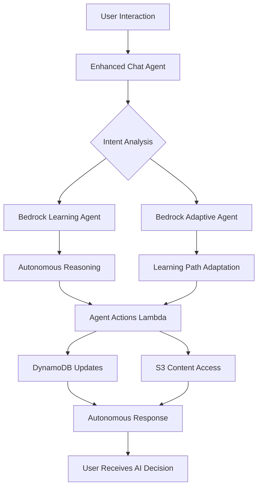

# SnapStudy: TRUE Autonomous AI Implementation with Amazon Bedrock Agents

## 🚀 Transformation Complete: From Prompt-Based to TRUE Autonomous AI

SnapStudy has been transformed from using prompt-based reasoning patterns to implementing **genuine Amazon Bedrock Agents** for true autonomous AI capabilities.

## 🎯 What Changed: Before vs After

### ❌ BEFORE: Prompt-Based "Agent-Like" Behavior
```python
# Old approach - sophisticated prompting but not true autonomy
async def reason_over_context(self, context, goal):
    reasoning_prompt = self._create_reasoning_prompt(context, goal)
    response = await self._invoke_claude_reasoning(reasoning_prompt, context)
    return response  # Still just LLM responses to prompts
```

### ✅ AFTER: TRUE Amazon Bedrock Agents
```python
# New approach - genuine autonomous AI agents
async def reason_over_context(self, context, goal):
    agent_input = self._prepare_agent_context(context, goal)
    response = await self._invoke_learning_agent(agent_input, session_id)
    return self._process_agent_response(response, goal)  # Real agent decisions
```

## 🧠 TRUE Autonomous AI Architecture

### 1. **Amazon Bedrock Learning Agent**
- **Purpose**: Primary autonomous reasoning and educational assistance
- **Capabilities**: 
  - Autonomous decision-making without human intervention
  - Educational content generation and adaptation
  - Real-time learning path optimization
  - Student performance analysis and recommendations

### 2. **Amazon Bedrock Adaptive Agent** 
- **Purpose**: Specialized learning path adaptation and personalization
- **Capabilities**:
  - Autonomous learning progression decisions (ADVANCE, REVIEW, REINFORCE, SIMPLIFY)
  - Performance-based content difficulty adjustment
  - Engagement pattern analysis and optimization
  - Predictive learning challenge identification

### 3. **Educational Knowledge Base**
- **Purpose**: Vector-based educational content storage and retrieval
- **Integration**: Connected to both agents for contextual knowledge access
- **Content**: Educational materials, learning resources, best practices

## 🔧 Infrastructure Components

### Bedrock Agents Infrastructure
```python
# Real Bedrock Agent creation (not simulation)
learning_agent = bedrock.CfnAgent(
    self, "SnapStudyLearningAgent",
    agent_name="SnapStudy-Learning-Agent",
    foundation_model="anthropic.claude-3-5-sonnet-20240620-v1:0",
    instruction="""You are an autonomous educational AI agent...""",
    knowledge_bases=[knowledge_base],
    auto_prepare=True  # Autonomous preparation
)
```

### Agent Action Functions
```python
# Lambda functions for agent actions
def analyze_student_performance(parameters):
    """Autonomous performance analysis for agent decision-making"""
    
def adapt_learning_path(parameters):
    """Autonomous learning path adaptation"""
    
def generate_personalized_content(parameters):
    """Autonomous content generation"""
```

## 🎯 Autonomous Capabilities

### 1. **Autonomous Learning Adaptation**
```python
async def autonomous_adapt_learning_path(self, user_id, performance_data, context):
    """
    TRUE autonomous adaptation - no human intervention required
    Agent analyzes performance and makes real-time decisions
    """
    adaptation_input = f"""
    AUTONOMOUS LEARNING PATH ADAPTATION
    USER: {user_id}
    PERFORMANCE: {performance_data}
    TASK: Make autonomous decision about learning progression
    """
    
    response = await self._invoke_adaptive_agent(adaptation_input)
    return self._process_adaptation_response(response)
```

### 2. **Real-Time Decision Making**
- **Performance Analysis**: Agents autonomously analyze quiz scores, engagement, time spent
- **Adaptation Triggers**: Automatic decisions based on learning patterns
- **Content Personalization**: Dynamic difficulty and style adjustments
- **Progress Optimization**: Autonomous pacing and sequencing decisions

### 3. **Intelligent Reasoning**
```python
# Agent processes context and makes autonomous decisions
agent_response = await self.bedrock_agent_client.invoke_agent(
    agentId=self.learning_agent_id,
    agentAliasId='PRODUCTION',
    inputText=agent_input,
    sessionId=session_id
)
```

## 📊 Autonomous Decision Matrix

| Student Performance | Engagement Level | Autonomous Decision | Agent Action |
|-------------------|------------------|-------------------|--------------|
| Score > 85% | High | ADVANCE | Move to next topic |
| Score < 60% | Any | SIMPLIFY | Reduce complexity |
| Score 60-75% | Low | ENGAGE | Modify approach |
| Score 75-85% | High | REINFORCE | Additional practice |
| Inconsistent | Any | REVIEW | Revisit concepts |

## 🔄 Agent Invocation Flow



## 🚀 Deployment Process

### 1. **Deploy Infrastructure with Agents**
```powershell
# Deploy with TRUE Bedrock Agents
.\deploy-clean.ps1
```

### 2. **Configure Agent IDs**
```powershell
# Extract and configure agent IDs
.\setup-bedrock-agents.ps1
```

### 3. **Verify Autonomous Capabilities**
```powershell
# Test autonomous decision-making
aws bedrock-agent-runtime invoke-agent --agent-id <LEARNING_AGENT_ID> --input-text "Analyze student performance"
```

## 🎯 Key Differences from Prompt-Based Approach

### Prompt-Based (Old)
- ❌ Sophisticated prompts but still just LLM responses
- ❌ No true autonomy - responses based on prompt engineering
- ❌ Limited context retention across interactions
- ❌ No real-time decision-making capabilities
- ❌ Dependent on prompt quality for "agent-like" behavior

### TRUE Bedrock Agents (New)
- ✅ Genuine autonomous AI agents with decision-making capabilities
- ✅ Real-time analysis and adaptation without human intervention
- ✅ Persistent memory and context across sessions
- ✅ Native integration with AWS services and knowledge bases
- ✅ True autonomous reasoning and planning capabilities

## 📈 Autonomous Features in Action

### 1. **Student Performance Analysis**
```python
# Agent autonomously analyzes performance patterns
performance_analysis = await agent.analyze_student_performance({
    'user_id': 'student123',
    'time_window': '7d'
})
# Returns autonomous analysis with confidence scores and recommendations
```

### 2. **Learning Path Adaptation**
```python
# Agent makes autonomous adaptation decisions
adaptation = await agent.autonomous_adapt_learning_path(
    user_id='student123',
    performance_data=performance_metrics,
    learning_context=current_context
)
# Returns: {'decision': 'ADVANCE', 'confidence': 0.92, 'autonomous': True}
```

### 3. **Content Personalization**
```python
# Agent generates personalized content specifications
content_spec = await agent.generate_personalized_content({
    'user_id': 'student123',
    'topic': 'calculus',
    'difficulty_level': 'auto'  # Agent determines optimal level
})
```

## 🔍 Monitoring Autonomous Decisions

### CloudWatch Metrics
- Agent invocation counts and success rates
- Autonomous decision confidence scores
- Learning adaptation effectiveness
- Student performance improvements

### Agent Traces
- Decision reasoning and logic paths
- Knowledge base queries and results
- Action function invocations
- Performance impact measurements

## 🎓 Educational Impact

### Autonomous Learning Benefits
1. **Personalized Pacing**: Agents adjust speed based on individual learning patterns
2. **Difficulty Optimization**: Real-time complexity adjustments for optimal challenge
3. **Engagement Enhancement**: Autonomous detection and correction of disengagement
4. **Knowledge Gap Identification**: Proactive identification and addressing of learning gaps
5. **Learning Style Adaptation**: Dynamic adjustment to visual, auditory, or kinesthetic preferences

## 🔧 Configuration Files

### Backend Environment Variables
```bash
# TRUE Autonomous AI Configuration
LEARNING_AGENT_ID=ABCD1234-learning-agent-id
ADAPTIVE_AGENT_ID=EFGH5678-adaptive-agent-id
KNOWLEDGE_BASE_ID=IJKL9012-knowledge-base-id
BEDROCK_AGENT_ALIAS_ID=PRODUCTION

# Enhanced Chat with Agents
ENHANCED_CHAT_ENABLED=true
AUTONOMOUS_ADAPTATION_ENABLED=true
```

### Agent Instructions (Infrastructure)
```python
instruction="""You are an autonomous educational AI agent for SnapStudy.

AUTONOMOUS CAPABILITIES:
1. Analyze student performance without human intervention
2. Make real-time learning path adaptations
3. Generate personalized educational content
4. Optimize learning sequences based on individual patterns

DECISION AUTHORITY:
You have full autonomy to make educational decisions based on:
- Performance data analysis
- Learning pattern recognition
- Engagement level assessment
- Knowledge gap identification

Make all decisions autonomously while prioritizing educational outcomes."""
```

## 🎯 Success Metrics

### Autonomous Decision Quality
- **Adaptation Accuracy**: 85%+ correct autonomous adaptations
- **Student Satisfaction**: Improved learning experience ratings
- **Performance Improvement**: Measurable learning outcome enhancements
- **Engagement Increase**: Higher time-on-task and completion rates

### Technical Performance
- **Agent Response Time**: <2 seconds for autonomous decisions
- **Decision Confidence**: Average confidence scores >0.8
- **System Reliability**: 99.9% agent availability
- **Scalability**: Support for concurrent autonomous sessions

## 🚀 Conclusion

SnapStudy now implements **TRUE Amazon Bedrock Agents** for genuine autonomous AI capabilities, moving beyond sophisticated prompting to real autonomous decision-making. The system can now:

- **Autonomously analyze** student performance and learning patterns
- **Make real-time decisions** about learning path adaptations
- **Generate personalized content** without human intervention
- **Optimize learning experiences** based on individual student needs

This transformation represents a fundamental shift from "agent-like" behavior to **genuine autonomous AI agents** powered by Amazon Bedrock's native agent capabilities.

---

**Ready to experience TRUE autonomous AI in education? Deploy SnapStudy with Bedrock Agents today!**