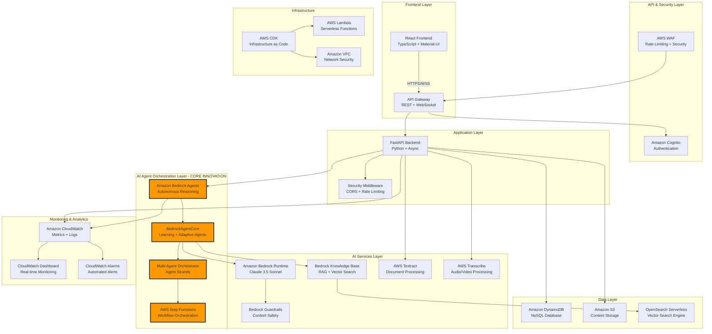

# SnapStudy Updated Architecture Diagram

## System Architecture Overview

## Key Architecture Components

### 1. Frontend Layer
- **React Application**: TypeScript-based SPA with Material-UI components
- **Real-time Features**: WebSocket connections for chat and live updates
- **Security**: Input sanitization, XSS protection, secure storage
- **Offline Support**: Service workers and local caching

### 2. API & Security Layer
- **AWS WAF**: Web Application Firewall with rate limiting (100 req/min)
- **API Gateway**: RESTful APIs + WebSocket support
- **Amazon Cognito**: User authentication with JWT tokens
- **CORS Security**: Cross-origin request protection

### 3. Application Layer
- **FastAPI Backend**: High-performance async Python framework
- **Security Middleware**: Request logging, rate limiting, security headers
- **Error Handling**: Comprehensive exception handling with user-friendly messages
- **Health Monitoring**: System health checks and status reporting

### 4. AI Agent Orchestration Layer (CORE INNOVATION)
- **Amazon Bedrock Agents**: TRUE autonomous reasoning and decision-making
- **BedrockAgentCore**: Learning Agent + Adaptive Agent coordination
- **Multi-Agent Orchestrator**: Agent Strands for complex workflows
- **AWS Step Functions**: Orchestrates multi-step agent workflows

### 5. AI Services Layer
- **Bedrock Runtime**: Claude 3.5 Sonnet for content generation
- **Knowledge Base**: RAG with vector search for educational content
- **Guardrails**: Content safety and educational appropriateness
- **Document Processing**: Textract for PDFs, Transcribe for audio/video

### 6. Data Layer
- **DynamoDB**: User profiles, lessons, progress, analytics
- **S3**: Content storage with lifecycle policies
- **OpenSearch**: Vector search engine for knowledge base

### 7. Monitoring & Analytics
- **CloudWatch**: Comprehensive monitoring and logging
- **Custom Dashboards**: Real-time agent performance metrics
- **Automated Alarms**: Error rates, latency, security threats

## Agent Architecture Details

### Learning Agent Capabilities
- **Autonomous Reasoning**: Analyzes student context without prompts
- **Memory Management**: Stores and retrieves learning patterns
- **Function Invocation**: Calls specialized educational functions
- **Content Generation**: Creates personalized micro-lessons

### Adaptive Agent Capabilities
- **Performance Analysis**: Evaluates quiz scores and engagement
- **Path Optimization**: Adjusts learning sequences autonomously
- **Difficulty Calibration**: Adapts content complexity in real-time
- **Decision Making**: Makes autonomous adaptation decisions

### Multi-Agent Strands
1. **Content Generation Strand**: Planning → Generation → Review → Personalization
2. **Assessment Strand**: Analysis → Quiz Generation → Difficulty Calibration
3. **Personalization Strand**: Profile Analysis → Pattern Recognition → Recommendations

## Security Architecture

### Data Protection
- **Encryption at Rest**: S3 (AES-256), DynamoDB (AWS managed)
- **Encryption in Transit**: TLS 1.2+ for all communications
- **Secure Storage**: Web Crypto API for sensitive local data
- **Session Management**: Automatic timeout and cleanup

### Access Control
- **IAM Roles**: Least privilege principle
- **JWT Tokens**: Secure authentication with refresh logic
- **API Security**: Request validation and sanitization
- **CORS Protection**: Restricted cross-origin requests

### Content Safety
- **Bedrock Guardrails**: Educational content validation
- **Input Sanitization**: XSS and injection protection
- **Content Filtering**: Age-appropriate and safe content
- **PII Detection**: Automatic redaction of sensitive data

## Scalability Features

### Auto-Scaling
- **DynamoDB**: On-demand scaling
- **Lambda**: Automatic concurrency scaling
- **API Gateway**: Built-in scaling
- **S3**: Unlimited storage capacity

### Performance Optimization
- **Caching**: Multi-level caching strategy
- **CDN**: CloudFront for static content
- **Connection Pooling**: Efficient database connections
- **Async Processing**: Non-blocking operations

### Cost Optimization
- **Serverless Architecture**: Pay-per-use pricing
- **S3 Lifecycle Policies**: Automatic data archiving
- **Reserved Capacity**: For predictable workloads
- **Resource Monitoring**: Cost tracking and optimization

## Deployment Architecture

### Infrastructure as Code
- **AWS CDK**: Python-based infrastructure definitions
- **Environment Management**: Dev, staging, production environments
- **Automated Deployment**: CI/CD pipelines
- **Configuration Management**: Environment-specific settings

### Monitoring & Observability
- **Real-time Metrics**: Agent performance, API latency, error rates
- **Distributed Tracing**: Request flow across services
- **Log Aggregation**: Centralized logging with search
- **Alerting**: Automated incident response

This architecture demonstrates a production-ready, scalable AI-powered learning platform that leverages AWS Bedrock's advanced agent capabilities for truly autonomous educational experiences.