# SnapStudy Data Flow Diagram

## Complete Data Flow Architecture

```mermaid
sequenceDiagram
    participant User as 👤 User
    participant Frontend as 🖥️ React Frontend
    participant API as 🌐 API Gateway
    participant Backend as ⚡ FastAPI Backend
    participant Agents as 🤖 Bedrock Agents
    participant Bedrock as 🧠 Bedrock Runtime
    participant KB as 📚 Knowledge Base
    participant DB as 🗄️ DynamoDB
    participant S3 as 📦 S3 Storage
    participant Monitor as 📊 CloudWatch

    Note over User, Monitor: 1. Content Upload & Processing Flow
    
    User->>Frontend: Upload PDF/Video/Audio
    Frontend->>API: POST /api/v1/lessons/upload
    API->>Backend: Forward upload request
    Backend->>S3: Store original content
    Backend->>Backend: Extract text (Textract/Transcribe)
    Backend->>Agents: Analyze content structure
    Agents->>Bedrock: Generate lesson analysis
    Bedrock->>Agents: Return structured analysis
    Agents->>Backend: Content analysis complete
    Backend->>DB: Store lesson metadata
    Backend->>Frontend: Processing status updates
    Frontend->>User: Show upload progress
    
    Note over User, Monitor: 2. Adaptive Learning Flow
    
    User->>Frontend: Start lesson
    Frontend->>API: GET /api/v1/lessons/{id}/adaptive
    API->>Backend: Initialize adaptive session
    Backend->>Agents: Create learning context
    Agents->>Agents: Autonomous reasoning
    Agents->>KB: Retrieve relevant content
    KB->>Agents: Return educational materials
    Agents->>Bedrock: Generate personalized micro-lesson
    Bedrock->>Agents: Return customized content
    Agents->>Backend: Micro-lesson ready
    Backend->>DB: Store lesson progress
    Backend->>Frontend: Return micro-lesson
    Frontend->>User: Display personalized content
    
    Note over User, Monitor: 3. Quiz Generation & Assessment
    
    User->>Frontend: Complete micro-lesson
    Frontend->>API: POST /api/v1/quiz/generate
    API->>Backend: Generate quiz request
    Backend->>Agents: Analyze lesson concepts
    Agents->>Bedrock: Create adaptive questions
    Bedrock->>Agents: Return quiz questions
    Agents->>Backend: Quiz generation complete
    Backend->>DB: Store quiz data
    Backend->>Frontend: Return quiz
    Frontend->>User: Present quiz interface
    
    User->>Frontend: Submit quiz answers
    Frontend->>API: POST /api/v1/quiz/evaluate
    API->>Backend: Evaluate answers
    Backend->>Agents: Autonomous evaluation
    Agents->>Bedrock: Analyze responses
    Bedrock->>Agents: Return evaluation
    Agents->>Backend: Assessment complete
    Backend->>DB: Update performance data
    Backend->>Monitor: Log quiz metrics
    
    Note over User, Monitor: 4. Autonomous Adaptation Decision
    
    Backend->>Agents: Trigger adaptation analysis
    Agents->>Agents: Retrieve user memory
    Agents->>Agents: Analyze performance patterns
    Agents->>Agents: Make autonomous decision
    
    alt Score < 60% (Struggling)
        Agents->>Backend: Decision: SIMPLIFY
        Backend->>Agents: Generate easier content
    else Score 60-80% (Learning)
        Agents->>Backend: Decision: REINFORCE
        Backend->>Agents: Generate practice content
    else Score > 80% (Mastering)
        Agents->>Backend: Decision: ADVANCE
        Backend->>Agents: Generate next concept
    end
    
    Agents->>Backend: Adaptation complete
    Backend->>DB: Update learning path
    Backend->>Frontend: Next content ready
    Frontend->>User: Seamless transition
    
    Note over User, Monitor: 5. Real-time Chat Flow
    
    User->>Frontend: Open chat widget
    Frontend->>API: WebSocket connection
    API->>Backend: Establish chat session
    Backend->>Agents: Initialize chat context
    
    User->>Frontend: Send message
    Frontend->>API: WebSocket message
    API->>Backend: Process chat message
    Backend->>Agents: Autonomous intent recognition
    Agents->>Agents: Analyze user intent
    
    alt Intent: Summarize
        Agents->>KB: Retrieve lesson summary
        KB->>Agents: Return summary data
        Agents->>Bedrock: Generate summary
    else Intent: Explain
        Agents->>KB: Find concept explanation
        KB->>Agents: Return explanation data
        Agents->>Bedrock: Generate explanation
    else Intent: Quiz
        Agents->>Backend: Trigger quiz generation
        Backend->>Agents: Quiz ready
    end
    
    Bedrock->>Agents: Return response
    Agents->>Backend: Chat response ready
    Backend->>API: Stream response
    API->>Frontend: WebSocket stream
    Frontend->>User: Display AI response
    
    Note over User, Monitor: 6. Analytics & Progress Tracking
    
    Frontend->>API: GET /api/v1/analytics/dashboard
    API->>Backend: Analytics request
    Backend->>DB: Query user data
    DB->>Backend: Return metrics
    Backend->>Agents: Analyze learning patterns
    Agents->>Backend: Pattern analysis
    Backend->>Frontend: Return dashboard data
    Frontend->>User: Display analytics
    
    Note over User, Monitor: 7. Multi-Modal Content Generation
    
    User->>Frontend: Request audio version
    Frontend->>API: POST /api/v1/multimedia/generate
    API->>Backend: Generate audio request
    Backend->>Agents: Multi-modal generation
    Agents->>Backend: Start audio generation
    Backend->>Backend: Text-to-speech processing
    Backend->>S3: Store audio file
    Backend->>DB: Update content metadata
    Backend->>Frontend: Audio generation complete
    Frontend->>User: Audio player available
    
    Note over User, Monitor: 8. Monitoring & Error Handling
    
    Backend->>Monitor: Log all operations
    Monitor->>Monitor: Analyze metrics
    
    alt Error Detected
        Monitor->>Backend: Trigger alert
        Backend->>Frontend: Error notification
        Frontend->>User: User-friendly error
    else Performance Issue
        Monitor->>Backend: Scale resources
        Backend->>Backend: Optimize performance
    end
```



## Data Flow Patterns

### 1. Content Processing Pipeline
```
Upload → Storage → Analysis → Agent Processing → Lesson Generation → User Delivery
```

**Key Features:**
- Asynchronous processing with real-time status updates
- Multi-format support (PDF, video, audio, text)
- Automatic content structure analysis
- Quality validation and safety checks

### 2. Adaptive Learning Loop
```
User Performance → Agent Analysis → Autonomous Decision → Content Adaptation → Delivery
```

**Decision Matrix:**
- **Score < 60%**: SIMPLIFY (reduce complexity, add examples)
- **Score 60-80%**: REINFORCE (additional practice, different approach)
- **Score > 80%**: ADVANCE (next concept, increase difficulty)
- **Low Engagement**: ENGAGE (interactive elements, gamification)
- **High Performance**: ACCELERATE (faster pace, advanced topics)

### 3. Real-time Communication Flow
```
User Input → Intent Recognition → Context Analysis → Response Generation → Streaming Delivery
```

**Intent Types:**
- **Summarization**: `/summarize` - Lesson overview
- **Explanation**: `/explain [topic]` - Concept clarification
- **Quiz**: `/quiz` - Assessment generation
- **Progress**: `/progress` - Learning analytics
- **Help**: `/help` - Available commands
- **Encouragement**: Motivational responses
- **General Chat**: Contextual conversation

### 4. Multi-Agent Orchestration
```
Trigger → Agent Strand → Parallel Processing → Result Aggregation → Decision Making
```

**Agent Strands:**
1. **Content Generation Strand**:
   - Planning Agent → Content Agent → Review Agent → Personalization Agent

2. **Assessment Strand**:
   - Analysis Agent → Quiz Generation Agent → Calibration Agent

3. **Personalization Strand**:
   - Profile Agent → Pattern Recognition Agent → Recommendation Agent

### 5. Data Synchronization Flow
```
Local State → API Update → Database Sync → Real-time Broadcast → UI Update
```

**Synchronization Points:**
- Learning progress across devices
- Quiz scores and performance metrics
- Chat history and context
- User preferences and settings
- Content generation status

## Security Data Flow

### Authentication Flow
```
Login → Cognito Verification → JWT Generation → Token Storage → API Authorization
```

### Data Protection Flow
```
Input Sanitization → Encryption → Secure Transmission → Validation → Safe Storage
```

### Content Safety Flow
```
Content Generation → Guardrails Check → Safety Validation → Approval → User Delivery
```

## Performance Optimization Flow

### Caching Strategy
```
Request → Cache Check → Cache Hit/Miss → Data Retrieval → Cache Update → Response
```

**Cache Layers:**
- Browser cache for static assets
- API response caching
- Database query result caching
- Generated content caching

### Load Balancing Flow
```
User Request → Load Balancer → Health Check → Route Selection → Service Delivery
```

## Error Handling Flow

### Error Detection
```
Error Occurrence → Error Classification → Logging → User Notification → Recovery Action
```

**Error Types:**
- **Network Errors**: Retry with exponential backoff
- **Authentication Errors**: Redirect to login
- **Validation Errors**: Field-specific feedback
- **Server Errors**: Generic message with error ID
- **Agent Errors**: Fallback to basic functionality

### Recovery Mechanisms
```
Error Detection → Fallback Strategy → Graceful Degradation → User Communication
```

## Monitoring Data Flow

### Metrics Collection
```
Application Events → CloudWatch Metrics → Dashboard Updates → Alert Evaluation
```

**Key Metrics:**
- Agent invocation success rate
- API response times
- User engagement metrics
- Content generation performance
- Error rates and types

### Alert Flow
```
Threshold Breach → Alert Trigger → Notification → Investigation → Resolution
```

This comprehensive data flow demonstrates how SnapStudy orchestrates complex AI-powered educational experiences through autonomous agents, real-time communication, and intelligent adaptation mechanisms.